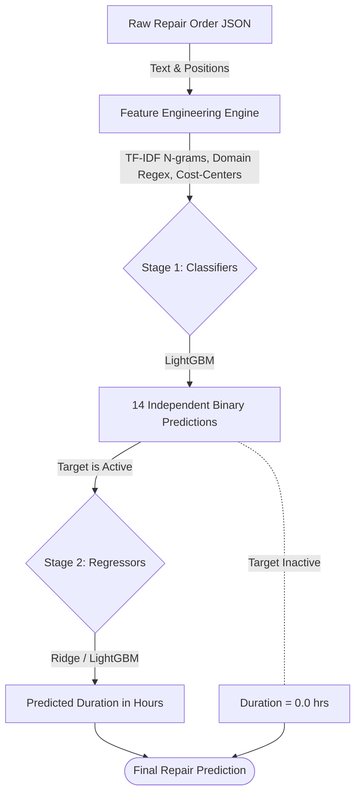

# Work Step Time Prediction Pipeline

[](https://github.com/danielHelmke377/work-step-time-prediction/actions/workflows/ci.yml)
[](LICENSE)

Predicts **14 binary work steps** (e.g., `bodyrepair`, `paintingSpraying`) and their **duration in hours** from unstructured JSON repair order data. 

This repository represents the **first step in prototyping the best possible model** for a work-step time prediction pipeline, evolving rapidly from a 4-hour assessment into a highly optimized architecture. While not yet a fully integrated production system, it demonstrates the systematic iteration required to build one.

To see how this model evolved from a rapid 4-hour prototype to its highly optimized final state, explore the experimental logs inside the [Project Evolution Summary](docs/project_evolution.md).

## 🚀 Impact & Results

The final prototype pipeline achieves strong empirical performance for the business context, optimizing heavily for frequency-weighted metrics (weighting targets by how commonly work steps appear in actual orders).

| Metric | Value |
|---|---|
| **Macro F1** | **0.838** |
| **Frequency-Weighted F1** | **0.935** |
| **Frequency-Weighted MAE** | **0.96 hrs** |
| **Frequency-Weighted Accuracy** | **0.943** |

*Note: All metrics are calculated on a hold-out test set (20% of the data) from a single strict Train/Val/Test split. Cross-validation was not used in this prototype evaluation.*

## 🏗️ Architecture

A **Two-Stage Pipeline** handles the multi-label to regression problem:



1. **Stage 1 — Multi-Label Classifiers (Occurrence):** Predicts binary presence (0/1) for each of the 14 targets independently. Uses `LGBMClassifier` uniformly across all 14 targets, with thresholds optimized per-target via validation F1.
   - Features: TF-IDF word n-grams, character n-grams, time/price aggregations per cost-center, and domain keyword regex flags.
2. **Stage 2 — Conditional Regressors (Duration):** Predicts duration (hours) *only for targets predicted active by Stage 1*. Uses a mix of `Ridge` Regression and `LGBMRegressor` depending on the target dataset size and skew.

## 💻 Repository Usage (Synthetic Data Reproducibility)

> [!NOTE]
> **Data Privacy & Reproducibility:** Due to customer confidentiality and NDA restrictions, the proprietary JSON repair order dataset used to train the original model is **not** included in this public repository. 
> 
> However, to ensure **full reproducibility** of the pipeline, this repository includes a synthetic data generator. The pipeline will automatically generate and fall back to the synthetic dataset if the proprietary data is missing, allowing you to run the training and inference scripts identically to the production version.

### Quick Start: Running the Pipeline

1. **Install Dependencies:**
   ```bash
   pip install -r requirements.txt
   ```
2. **Train the Model:**
   ```bash
   make train
   ```
   *(This automatically generates `data/synthetic_orders.json` if it doesn't exist, and trains the full classification/regression pipeline on it).*
3. **Run Inference & Explanations:**
   ```bash
   make predict
   ```
   *(Runs prediction on a demo synthetic order, outputting the predictions and the exact keywords that triggered them).*

### Exploring the Architecture

If you are reviewing this repository:
1. **Start with the [Project Evolution Summary](docs/project_evolution.md)**: This document is the heart of the repository. It walks through the mindset, experiments, and math behind how the pipeline evolved from a baseline ruleset to its final state.
2. **Read the [Model Card](MODEL_CARD.md)**: Details the intended use cases, data biases, and acknowledged edge-case failure modes.
3. **Check `scripts/train.py` & `scripts/predict.py`**: Review the `RepairOrderTrainer` and `RepairOrderPredictor` classes to see how code is cleanly orchestrated.
4. **Review `src/repair_order/features.py`**: See how raw, unstructured German repair texts are tokenized, embedded, and transformed into numeric feature vectors.

### Example Prediction Output
When running inference via `make predict`, the script outputs a clean, explainable report detailing not only the predictions, but the rules and keywords that triggered them:

```text
====================================================================
  WORK STEP TIME PREDICTION REPORT
====================================================================
  Make            : VOLKSWAGEN
  Line items      : 6
  Total input cost: EUR 1250.40

  TARGET                          ACTIVE    PROB  PRED(hrs)
  ------------------------------------------------------------
  Calibration (ADAS/cameras)         YES    0.94       1.50
  Body/chassis measurement           YES    0.68       2.00
  Dis-/mounting                      YES    0.99       4.20
  Body repair                        YES    0.87       3.40
  Painting — preparation             YES    0.83       1.20
  Painting — spraying                YES    0.82       2.30
  Glass replacement                  ---    0.11       0.00
  ...

  Total predicted repair time: 14.60 hrs

  EXPLANATION - Why each work step was predicted:
  ------------------------------------------------------------
  [Calibration (ADAS/cameras)]
    Keywords matched : kw_kalibrier, kw_sensor
  [Body/chassis measurement]
    Keywords matched : kw_karosserie, kw_vermessung
  [Painting — spraying]
    Keywords matched : kw_lack
====================================================================
```

## 📁 Repository Structure

```
.
├── scripts/                     # Core runnable scripts
│   ├── eda.py                   # Exploratory Data Analysis
│   ├── train.py                 # Core training pipeline (LightGBM classifiers + best regressors)
│   └── predict.py               # Inference script
│
├── src/repair_order/            # Shared Python package
│   ├── config.py                # Constants (targets, keywords, makes)
│   ├── features.py              # Feature engineering functions
│   └── pipeline.py              # Pipeline load + predict utilities
│
├── docs/                        # Documentation & Reports
│   ├── project_evolution.md     # Detailed log of all experiments and optimizations
│   ├── markdowns/               # Component-level model documentation
│   └── assets/                  # Plots and images
│
├── experiments/                 # Experimental pipelines (G-BERT, etc.)
│   ├── combined_best/           # Incremental best-pipeline combinations
│   ├── gbert_base/              # German BERT embedding replacement experiment
│   ├── hailrepair_mae_exp/      # Skew-handling and MAE reduction strategies
│   └── log_transform/           # Log-transformation analysis
│
├── tests/                       # Pytest verification
├── .github/                     # CI/CD Workflows
├── Makefile                     # Task runner
├── pyproject.toml               # Python dependencies & config
└── CHANGELOG.md                 # Version history
```
