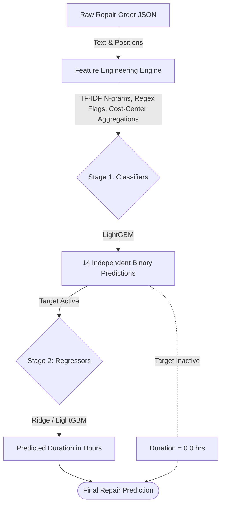
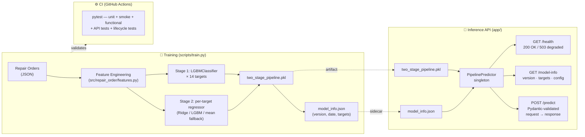
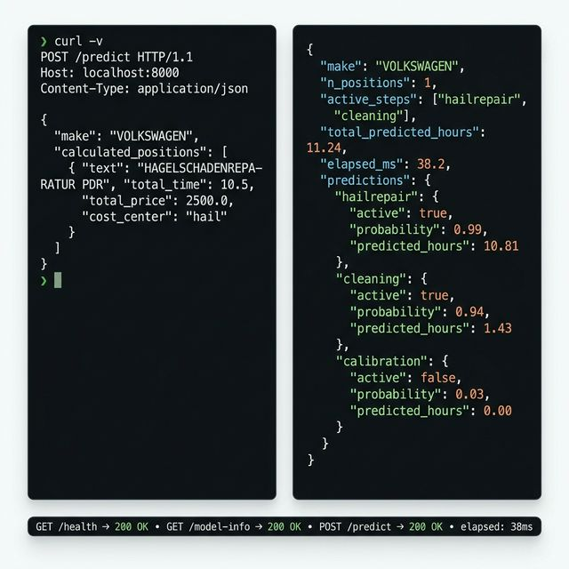

# Work Step Time Prediction Pipeline

[](https://github.com/danielHelmke377/work-step-time-prediction/actions/workflows/ci.yml)
[](tests/test_api.py)
[](LICENSE)
[](pyproject.toml)

A portfolio-grade ML engineering project demonstrating the **full stack** of a production-oriented prediction system — from raw data and model training to a Dockerised REST API, automated tests, a monitoring snapshot, and a structured model promotion workflow.

The domain: predicting **14 repair work steps** and their **execution time in hours** from unstructured JSON repair orders in the German automotive body-shop industry.

> Built from a rapid business assessment prototype and iterated toward production-oriented quality. See the [Project Evolution Summary](docs/project_evolution.md) for the full experiment path.

---

## What you can run right now

```bash
make data          # generate synthetic training data
make train         # train the two-stage pipeline + write metrics.json
make test          # 37 tests across 4 test files (smoke · functional · API · lifecycle)
make serve         # start the FastAPI service → http://localhost:8000/docs
make docker-serve  # same, but containerised
make train-challenger && make promote-dry  # demo the champion-challenger lifecycle
```

---

## Why this project matters

Body-shop planning depends on estimating **which repair steps will happen** and **how long they will take** before work begins. This repository tackles that problem with a practical two-stage ML system:

- **Stage 1:** predict which work steps occur
- **Stage 2:** predict duration only for the work steps predicted active

That design keeps the problem aligned with the real business workflow and avoids predicting duration for steps that are unlikely to happen.

---

## What this project demonstrates

- **Multi-label → conditional regression cascade**  
  Stage 1 classifies work-step occurrence; Stage 2 predicts duration only for active steps.

- **NLP on German domain text**  
  Uses TF-IDF word + character n-grams, 17 hand-crafted regex keyword flags, and cost-center / price aggregation features.

- **Systematic ML experimentation**  
  Tracks the path from baseline rules through logistic regression, LightGBM, BERT-embedding variants, and combined best-pipeline experiments.

- **Production-style inference API** *(new)*  
  FastAPI service with validated Pydantic v2 schemas, degraded-mode startup, `/health` + `/predict` + `/model-info` endpoints, and a 23-test integration suite.

- **Model lifecycle (champion–challenger)**  
  File-based lifecycle layer: train a challenger, evaluate against 3 explicit promotion rules, promote or reject with a structured decision report — no external registry.

- **Engineering discipline**  
  Shared `src/repair_order/` package, editable install, tests, CI on Python 3.11 + 3.12, reproducible public workflow on synthetic data.

- **Public reproducibility despite private source data**  
  Includes a synthetic data generator so the full train → test → predict path runs end to end without NDA-restricted production data.

---

## At a glance

- **Problem:** predict 14 binary repair work steps and their durations from raw JSON repair orders
- **Domain:** German automotive body-shop / repair-order planning
- **Modeling strategy:** two-stage pipeline with LightGBM classification + per-target best regressor
- **Text features:** TF-IDF word n-grams, character n-grams, regex keyword flags
- **Structured features:** cost-center, time, price, and count aggregations
- **Public workflow:** synthetic-data generation, training, tests, and inference included
- **Validation:** strict single train/validation/test split on the available dataset

---

## Impact & results

The final prototype performs strongly for the target business context, with evaluation focused on frequency-weighted metrics so common work steps contribute proportionally to the final score.

| Metric | Value |
|---|---:|
| **Macro F1** | **0.838** |
| **Frequency-Weighted F1** | **0.935** |
| **Frequency-Weighted MAE** | **0.96 hrs** |
| **Frequency-Weighted Accuracy** | **0.943** |

> [!IMPORTANT]
> All reported metrics come from a **single strict train/validation/test split** with a 20% hold-out test set.  
> Cross-validation was **not** used in this prototype evaluation.

---

## Engineering showcase — key takeaways

This repository is designed to demonstrate **practical ML engineering skills** beyond just model performance:

- **End-to-end ML system** — raw JSON in, REST predictions out: feature engineering → training → serialised artifact → FastAPI → Docker container
- **Tested inference API** — 23 integration tests covering all 3 endpoints, validated schemas, degraded-mode graceful startup, Swagger UI
- **Champion-challenger lifecycle** — explicit 3-rule promotion logic (`make promote`), structured decision artifacts, archiving — no external registry needed
- **Production operational patterns** — health-check contract, artifact metadata sidecar, monitoring snapshot generation, containerised serving
- **Reproducible public workflow** — synthetic data generator means the full train → test → predict path runs for anyone, in CI and locally
- **Systematic experimentation** — documented path from rule baseline through logistic regression, LightGBM, and BERT embedding variants to the final pipeline

---

## Architecture

The core idea is a **two-stage pipeline** that separates *occurrence prediction* from *duration prediction*.



### Stage 1 — Multi-label occurrence prediction

Predicts binary presence (`0/1`) for each of the 14 work steps independently.

- Uses **`LGBMClassifier`** uniformly across all targets
- Optimizes **per-target decision thresholds** on the validation set using F1
- Combines text and structured features:
  - TF-IDF word n-grams
  - TF-IDF character n-grams
  - domain regex keyword flags
  - cost-center / price / time aggregations

### Stage 2 — Conditional duration prediction

Predicts duration **only** for targets predicted active by Stage 1.

- Uses a **per-target best regressor**
- Current pipeline selects from:
  - `Ridge`
  - `LGBMRegressor`
  - `ridge_auto`
- Targets with too few positive training samples fall back to the **mean of positive durations**

---

## End-to-end system overview

The project covers the complete lifecycle from raw data to a served REST API:



> Swagger UI is available at `http://localhost:8000/docs` when the service is running.

---

## Repository status

> [!NOTE]
> **Data privacy & reproducibility**  
> The proprietary customer dataset used for the original business results is **not included** in this public repository because of NDA and confidentiality constraints.
>
> This repository remains **fully reproducible on synthetic data**. You can generate synthetic orders, train the full two-stage pipeline, run tests, and execute predictions locally and in CI.

### Validated public workflow

The public workflow supports:

- synthetic data generation
- end-to-end training (champion + challenger)
- test execution (23 API + 14 lifecycle tests)
- batch prediction / explanation output
- model lifecycle: dry-run and promotion workflow
- CI validation on **Python 3.11 + 3.12**

---

## Quick start

> [!TIP]
> For the core pipeline, use **editable install from `pyproject.toml`**:
>
> ```bash
> pip install -e .[dev]
> ```
>
> `requirements.txt` is retained for compatibility with tools that expect a requirements file, but it is **not** the preferred setup path for the core workflow.

### 1) Create and activate a virtual environment

```bash
# Linux / macOS
python -m venv .venv
source .venv/bin/activate

# Windows PowerShell
python -m venv .venv
.\.venv\Scripts\Activate.ps1
```

### 2) Install dependencies

```bash
# Linux / macOS
pip install -e .[dev]

# Windows PowerShell
.\.venv\Scripts\python -m pip install -e .[dev]
```

### 3) Generate synthetic data

```bash
# Linux / macOS
python scripts/generate_synthetic_data.py

# Windows PowerShell
.\.venv\Scripts\python scripts/generate_synthetic_data.py
```

### 4) Train the pipeline

```bash
# Linux / macOS
python scripts/train.py --data data/synthetic_orders.json

# Windows PowerShell
.\.venv\Scripts\python scripts/train.py --data data/synthetic_orders.json
```

### 5) Run the test suite

```bash
# Linux / macOS
pytest -vv

# Windows PowerShell
.\.venv\Scripts\pytest -vv
```

### 6) Run batch inference

```bash
# Linux / macOS
python scripts/predict.py --batch 10

# Windows PowerShell
.\.venv\Scripts\python scripts/predict.py --batch 10
```

### 7) Start the inference API

```bash
# Install serving dependencies (FastAPI + Uvicorn) — one-time
pip install -e .[serve]

# Linux / macOS
uvicorn app.main:app --reload
# or:
make serve

# Windows PowerShell
.\.venv\Scripts\uvicorn app.main:app --reload
```

The API is now live at `http://localhost:8000`. Open `http://localhost:8000/docs` for the interactive Swagger UI.

---

## API quick reference



### Endpoints

| Method | Path | Purpose |
|---|---|---|
| `GET` | `/health` | Liveness + model-readiness check |
| `POST` | `/predict` | Predict work steps and durations for one repair order |
| `GET` | `/model-info` | Pipeline version, targets, and feature configuration |

### Example request

```bash
curl -X POST http://localhost:8000/predict \
  -H "Content-Type: application/json" \
  -d '{
    "make": "VOLKSWAGEN",
    "calculated_positions": [
      {"text": "HAGELSCHADENREPARATUR PDR-METHODE", "total_time": 10.5, "total_price": 2500.0, "cost_center": "hail"},
      {"text": "FAHRZEUGREINIGUNG", "total_time": 0.5, "total_price": 40.0, "cost_center": "others"}
    ],
    "explain": true
  }'
```

### Example response (abbreviated)

```json
{
  "make": "VOLKSWAGEN",
  "n_positions": 2,
  "input_summary": { "total_time_hrs": 11.0, "total_price_eur": 2540.0 },
  "predictions": {
    "hailrepair":   { "label": "Hail repair",  "active": true,  "probability": 1.00, "threshold": 0.35, "predicted_hours": 10.81 },
    "cleaning":     { "label": "Cleaning",     "active": true,  "probability": 1.00, "threshold": 0.30, "predicted_hours":  1.58 },
    "calibration": { "label": "Calibration",  "active": false, "probability": 0.02, "threshold": 0.42, "predicted_hours":  0.00 }
  },
  "active_steps": ["hailrepair", "cleaning"],
  "total_predicted_hours": 12.39,
  "elapsed_ms": 37.1,
  "explanation": {
    "hailrepair": { "triggered_keywords": ["hagel", "pdr"], "matching_positions": ["HAGELSCHADENREPARATUR PDR-METHODE"] }
  }
}
```

### Degraded mode

If the pipeline artifact (`models/two_stage_pipeline.pkl`) is not found at startup, the service starts in **degraded mode** rather than crashing:

```json
// GET /health → HTTP 503
{ "status": "degraded", "model_loaded": false, "n_targets": 0 }

// POST /predict → HTTP 503
{ "error": { "code": "MODEL_NOT_READY", "message": "...", "details": null } }
```

Run `make train` to create the artifact, then restart the service.

---

## Running with Docker

The API is fully containerised. The container image is lean (~250 MB) and uses a multi-stage build to keep runtime dependencies minimal.

### Quick demo (recommended)

```bash
# 1. Train locally first (populates models/)
make data && make train

# 2. Build and start the container (mounts models/ read-only)
make docker-serve
# or equivalently:
docker compose up --build
```

The API is now reachable at `http://localhost:8000`.  
Open `http://localhost:8000/docs` for the Swagger UI.

### Without Compose

```bash
# Build the image
docker build -t work-step-time-prediction:latest .

# Run — mount the host models/ directory so the trained artifact is available
docker run -p 8000:8000 \
  -v "$(pwd)/models:/app/models:ro" \
  work-step-time-prediction:latest
```

### Model artifact strategy

| Approach | When to use |
|---|---|
| **Mount `models/` at runtime** *(default)* | Local demo, CI, or any workflow where you train outside the container |
| **Bake artifacts into the image** | Snapshot releases — uncomment the `COPY models/` line in the Dockerfile |

The service starts in **degraded mode** (HTTP 503 from `/health`) if the pickle is not found — this is intentional and mirrors the production health-check contract.

### Environment variables

| Variable | Default | Purpose |
|---|---|---|
| `PORT` | `8000` | Port Uvicorn listens on |
| `PYTHONUNBUFFERED` | `1` | Ensures logs stream immediately |

```bash
# Run on a different port
docker run -p 9000:9000 -e PORT=9000 \
  -v "$(pwd)/models:/app/models:ro" \
  work-step-time-prediction:latest
```

### Stop the container

```bash
make docker-down
# or:
docker compose down
```

---

## Model lifecycle

This repository demonstrates a controlled, file-based model lifecycle with
explicit promotion rules — no external registry required.

### Concepts

| Slot | Path | Description |
|---|---|---|
| **Champion** | `models/` | Live model — what the API and Docker setup serve |
| **Challenger** | `models/challenger/` | Newly trained candidate awaiting comparison |
| **Archive** | `models/archive/<version>_<ts>/` | Retired champions retained for audit |

### Workflow

```bash
# 1. Ensure the current champion has evaluation metrics
make train                    # writes models/metrics.json alongside the pkl

# 2. Train a challenger — live champion is untouched
make train-challenger         # writes models/challenger/metrics.json

# 3. Inspect the comparison without making any changes
make promote-dry              # prints rule evaluation to stdout

# 4. Promote if satisfied (or reject if rules fail)
make promote                  # archives old champion, copies challenger to models/
```

### Promotion rules

All three rules must pass for promotion to happen.  If any rule fails, the
champion is unchanged and the challenger remains in `models/challenger/`.

| Rule | Condition | Rationale |
|---|---|---|
| **R1 FW-F1** | challenger FW-F1 ≥ champion FW-F1 − 0.005 | Primary business metric; ≤0.5pp dip tolerated |
| **R2 FW-MAE** | challenger FW-MAE ≤ champion FW-MAE × 1.05 | Duration quality guard; ≤5% MAE regression allowed |
| **R3 Macro-F1** | challenger macro-F1 ≥ champion macro-F1 − 0.010 | Rare-step fairness; prevents collapse on low-frequency targets |

### Decision artifacts

Each promotion run writes two files to `models/`:

| File | Format | Purpose |
|---|---|---|
| `promotion_decision.json` | JSON | Machine-readable result (decision, per-rule pass/fail, timestamps) |
| `promotion_report.md` | Markdown | Human-readable summary with metric comparison table and rule rationale |

A `--dry-run` flag prints the report to stdout without touching any files.

---

## How to review this repository in 5 minutes

If you are reviewing this project for an interview, code review, or portfolio assessment, here is the fastest path to the most signal-dense files:

1. **Read this README** — problem, results, architecture, and live commands overview.

2. **Open [`app/main.py`](app/main.py) and [`app/predictor.py`](app/predictor.py)**  
   Shows the FastAPI app structure, lifespan model loading, singleton predictor, degraded-mode startup, and Pydantic v2 schemas.

3. **Open [`scripts/promote.py`](scripts/promote.py)**  
   Shows the champion-challenger comparison: 3 explicit promotion rules, dry-run mode, structured JSON + Markdown decision artifacts, archive management.

4. **Open [`scripts/train.py`](scripts/train.py)**  
   Shows training orchestration, TF-IDF + feature engineering, per-target threshold tuning, and artifact writing pattern.

5. **Browse `http://localhost:8000/docs`** after `make train && make serve`  
   Swagger UI displays the full API contract interactively.

6. **Scan the [monitoring snapshot](docs/markdowns/monitoring_snapshot.md)**  
   Shows the post-deployment quality reporting layer.

7. **Read the [Project Evolution Summary](docs/project_evolution.md)**  
   Best document for understanding *why* the final pipeline looks the way it does — experiment decisions, trade-offs, and lessons.

8. **Read the [Model Card](MODEL_CARD.md)**  
   Intended use, limitations, known failure modes, risk boundaries.

9. **Run the public synthetic workflow**  
   `make data && make train && make test && make serve` — the entire stack is reproducible locally.

---

## Example prediction output

When running inference, the script produces an explainable report showing predicted work steps, confidence, and matched keywords.

```text
====================================================================
  WORK STEP TIME PREDICTION REPORT
====================================================================
  Make            : VOLKSWAGEN
  Line items      : 6
  Total input cost: EUR 1250.40

  TARGET                          ACTIVE    PROB  PRED(hrs)
  ------------------------------------------------------------
  Calibration (ADAS/cameras)         YES    0.94       1.50
  Body/chassis measurement           YES    0.68       2.00
  Dis-/mounting                      YES    0.99       4.20
  Body repair                        YES    0.87       3.40
  Painting — preparation             YES    0.83       1.20
  Painting — spraying                YES    0.82       2.30
  Glass replacement                  ---    0.11       0.00
  ...

  Total predicted repair time: 14.60 hrs

  EXPLANATION - Why each work step was predicted:
  ------------------------------------------------------------
  [Calibration (ADAS/cameras)]
    Keywords matched : kw_kalibrier, kw_sensor
  [Body/chassis measurement]
    Keywords matched : kw_karosserie, kw_vermessung
  [Painting — spraying]
    Keywords matched : kw_lack
====================================================================
```

---

## Engineering quality signals

This repository is intentionally structured as a **package-first, reproducible ML project** rather than a notebook dump.

| Signal | Detail |
|---|---|
| Package structure | `src/repair_order/` shared package, editable install via `pyproject.toml` |
| Reproducibility | Synthetic data generator — full workflow runs without private data |
| Testing | Unit, smoke, functional, API integration, and lifecycle tests (37 tests across 4 files, 2 Python versions) |
| CI | GitHub Actions: lint (src+scripts+tests+app) → generate → train → predict → API validation |
| Inference API | FastAPI + Pydantic v2 — validated schemas, degraded-mode startup, Swagger UI |
| Containerisation | Multi-stage Dockerfile + Compose — `make docker-serve` starts the API in one step |
| Artifact metadata | `model_info.json` + `metrics.json` sidecar written by training |
| Model lifecycle | Champion-challenger workflow — `make promote-dry` / `make promote` with decision report |
| Model card | Intended use, limitations, failure modes — see [MODEL_CARD.md](MODEL_CARD.md) |
| Experiment log | Full path from baseline to final pipeline — see [Project Evolution](docs/project_evolution.md) |

---

## Future production hardening

This is a portfolio-grade project, not a deployed system. The following steps
would be required to take it to a production deployment:

| Area | What would change |
|---|---|
| **Model registry** | Replace the file-based `models/` lifecycle with MLflow, Vertex AI Model Registry, or SageMaker Model Registry for multi-team auditability |
| **Scheduled retraining** | Trigger `train-challenger` and `promote` via Airflow, Prefect, or GitHub Actions on a schedule or data-drift event |
| **Observability** | Feed `/predict` request logs to Prometheus + Grafana or Datadog; track confidence distributions and prevalence drift over time |
| **Config / secrets** | Move model paths, thresholds, and feature config to a config management layer (e.g., Hydra, Dynaconf) with secrets in Vault or cloud KMS |
| **Deployment environment** | Deploy the container to Cloud Run, ECS Fargate, or Kubernetes; add TLS termination, rate limiting, and autoscaling |
| **Ground-truth reconciliation** | Build a feedback loop comparing `predicted_hours` to actual repair hours to measure real-world drift |

---

## Limitations

- The original business metrics are based on **private, NDA-restricted source data**
- Evaluation uses a **single split**, not cross-validation
- The domain is specifically **German repair-order language and body-shop operations**
- Rare work steps remain harder to learn because positive examples are limited
- This is a **prototype-to-production-style portfolio project**, not a deployed SaaS system

For a fuller treatment of limitations, intended use, and failure modes, see the [Model Card](MODEL_CARD.md).

---

## Repository structure

```text
.
├── app/                            # ★ FastAPI inference service
│   ├── main.py                     #   App entry point, lifespan, exception handlers
│   ├── schemas.py                  #   Pydantic v2 request/response models
│   ├── predictor.py                #   PipelinePredictor singleton & adapter
│   └── routers/
│       ├── health.py               #   GET /health
│       ├── predict.py              #   POST /predict
│       └── model_info.py           #   GET /model-info
│
├── scripts/                        # Core runnable scripts
│   ├── generate_synthetic_data.py  #   Public synthetic dataset generator
│   ├── train.py                    #   Training pipeline (writes pkl + model_info.json + metrics.json)
│   ├── predict.py                  #   Batch inference script with explanations
│   ├── promote.py                  #   ★ Champion-challenger comparison + promotion
│   └── monitoring_report.py        #   ★ Post-deployment drift & quality report
│
├── src/repair_order/               # Shared Python package
│   ├── config.py                   #   Constants (targets, keywords, makes)
│   ├── features.py                 #   Feature engineering functions
│   └── pipeline.py                 #   Pipeline load + predict utilities
│
├── models/                         # Trained artifacts + lifecycle metadata
│   ├── two_stage_pipeline.pkl      #   Serialised champion pipeline
│   ├── model_info.json             #   ★ Version, date, targets (generated)
│   ├── metrics.json                #   ★ Champion evaluation metrics (generated)
│   ├── promotion_decision.json    #   ★ Latest promotion decision (generated)
│   ├── promotion_report.md         #   ★ Human-readable promotion summary (generated)
│   ├── challenger/                 #   ★ Challenger slot (train with --target-dir)
│   └── archive/                    #   ★ Retired champions (auto-managed by promote.py)
│
├── docs/                           # Documentation & reports
│   ├── project_evolution.md        #   Experiment history and optimization journey
│   ├── markdowns/                  #   Component-level documentation & training report
│   └── assets/                     #   Images / plots
│
├── experiments/                    # Experimental pipelines
├── tests/                          # Pytest suite (unit · smoke · functional · API · lifecycle)
├── .github/workflows/ci.yml        # CI: lint → generate → train → predict → API + lifecycle tests
├── Dockerfile                      # ★ Multi-stage API container image
├── docker-compose.yml             # ★ Local demo: mount models/ + start API
├── .dockerignore                   # ★ Excludes dev/test/data from build context
├── Makefile                        # Task runner (setup/data/train/test/serve/promote/docker-*)
├── pyproject.toml                  # Dependencies and tool config
├── MODEL_CARD.md                   # Model documentation and limitations
└── CHANGELOG.md                    # Version history
```

★ = added in the inference-API, Docker, and lifecycle extensions

---

## Related documentation

- [Project Evolution Summary](docs/project_evolution.md)
- [Model Card](MODEL_CARD.md)
- [API Contract](docs/markdowns/api_contract.md)
- [`tests/README.md`](tests/README.md)
- [`CHANGELOG.md`](CHANGELOG.md)

---

## License

This project is licensed under the MIT License. See [LICENSE](LICENSE).
